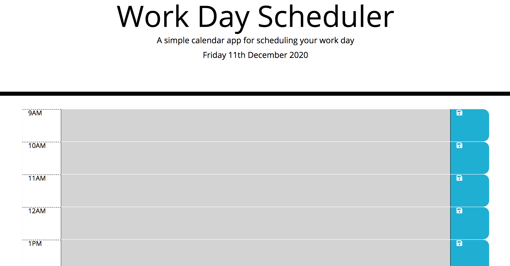

# Work-Day-Scheduler

A simple browser run application that allows user to save events for each hour of the work day. The app is set up to have past, present and future time blocks where events can be stored and cleared from local storage. 

# Link to Work Day Sceduler

https://karryns.github.io/Work-Day-Scheduler/

# Screeshot of Work Day Scheduler

# Technologies Utilised

HTML, CASS, JavaScript, JQuery, moment.js & local storage.